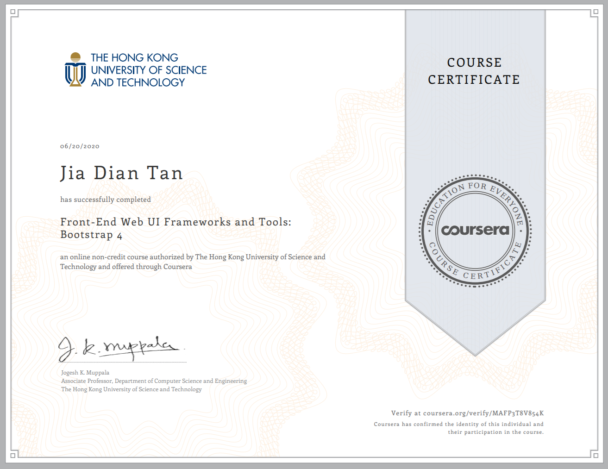

# Ristorante Con Fusion 🍲
Website built based from the assignments within the course "Front-End Web UI Frameworks and Tools: Bootstrap 4" by The Hong Kong University of Science and Technology.

## Link to Website (GitHub Page)
[https://thejayden.github.io/RistoranteConFusion](https://thejayden.github.io/RistoranteConFusion)
  
## Learning Points:
1. git command line
1. Web html design with bootstrap classes
1. Working with bootstrap grid system
1. Bootstrap CSS Components:
    > Nav, forms, tables, cards, images, media, tags, alerts, progress bars     
1. Bootstrap JS Components:
    > Tabs, pills, tabbed navigation, collapse, accordion, scrollspy, affix, tooltips, popovers, modals, carousel    
1. Using CSS preprocessors (Less, Sass) for reusable CSS
1. Deploying web project through NPM scripts and JavaScripts such as Grunt and Gulp
    > *cleaning up files using rimraf, copying files using copyfiles, compressing images using imagemin, deleting whitespaces from css, html, js codes with usemin, cssmin, htmlmin, uglifyjs.
Also learned how to use javascript task runners to develop automated tasks, such as time-grunt, jit-grunt modules to clean, copy and compress codes for deployment in distribution folder.

### Certificate

## Acknowledgments

* Based on [Billie Thompson's README template](https://gist.github.com/PurpleBooth/109311bb0361f32d87a2).
